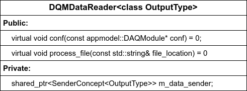

# DQMDataReader

This is an example of a design document for imaginary `DQMDataReader` class. It may not be how we want to implement this, it's just a case to show how to fill this document.

A class that reads the data, and sends `TriggerRecord`s and `TimeFrame`s into consumers.

## Motivation

The goal is to separate the extraction of the `TriggerRecord` from the rest of the code that extract `Fragments` and dispatches them to processing units, so the data-reading can be swapped without changing the rest of the code.

`DQMDataReader` can live as either its own object connected to others, or as an object used by another class.

### Prototype purpose

The main purpose is to support other prototype components by providing inputs to process.
Lessons to learn from this:

- What latencies can we expect reading a file?
- How do we parse different types of inputs (`TimeSlice`, `TriggerRecord`)?
- Do other DQM components require any information/metadata from the file header?

## Requirements

- Inputs: Location of the file (string).
- Outputs: `TriggerRecord` or `TimeSlice`, depending on the file (trigger or TPStream). Output sent via pubsub.
- Depending on the output type, `DQMDataReader` will send the file to different consumers, as `DQMDataHandler`s are different object for `TriggerRecord`s and `TimeSlice`s.
- Open a file with 150$\times$40WIBs, 1ms readout widow in less than 2s, to keep compliant with the requirements document.
- Need to be monitored with CCM: file rate in, TR/TS rate out.
- Need configuration object to specify the output connection.

**Assumptions**:

- A created object will only ever read either `TriggerRecord`s OR `TimeSlice`, if we want both, then we need two objects.

## Design

The `DQMDataReader` implements an object to be steered by other objects/applications that scan for files, and call the `DQMDataReader` to read a file.

* The class will be templated, where template specification is either for `TriggerRecord` or `TimeSlice`.
* The class will derived off `MonitorableObject` for monitoring metrics.
* The class will respond to `DAQModule` configuration command.
* Template specifications will read a file, convert to HDF5 object, read vector of TRs/TSs, and send them to teh iomanager::SenderConcept. These steps will be monitored via opmon (just the data/TR/TS rates and send calls).

Base template class diagram:



Example pseudocode of the TR specification:

```cpp
class DQMReaderTR : public DQMDataReader<TriggerRecord>
{
  void process_file(const std::string& file_location) override 
  {
    // Read hdf5 file...
    std::unique_ptr<HDF5RawDataFile> file_in = std::make_unique(file_location);

    // Get metadata if any
    Metadata meta = get_metadata(file_in);

    // Trigger records
    std::vector<std::shared_ptr<TriggerRecord>> tr = get_tr(file_in);

    for (iterator = tr.begin(); iterator != tr.end(); iterator++) {
      // Or however this should look like
      m_data_sender->try_send(std::move(*it), iomanager::Sender::s_no_block);
    }
  }
}
```

## Tests

All unit tests will have two shared objects created at the beginning of the unit test, with the output configured to send to a separate object.
The separate object will be a simple class that receives TR or TS, and checks its validity.

**Unit tests**:

1. Read a file. Did it crash?
2. Read a file. Non-zero TR/TS count?
3. Read a file. Is the read-out object a valid TR/TS? Check for the output type, and if fragment headers and data valid.
4. Read a file. Send it to the configured data-receiving object. Object sent?
5. Read a file. Send it to the configured data-receiving object. Object received?
6. Read a file. Send it to the configured data-receiving object. Object received valid?

**Integration test**:

No integration tests yet. Use emulation instead.

**Other**:

`DataReader` will be implemented as the first step in the emulation. It will read a file, produce diagnostic text output, and pass output object to consumer (if implemented).

## Closing Criteria

- [ ] All unit tests pass.
- [ ] The `DataReader` implemented in the first emulation prototype.
- [ ] The function of `DataReader` in emulation prototype demonstrated and documented in PR.
